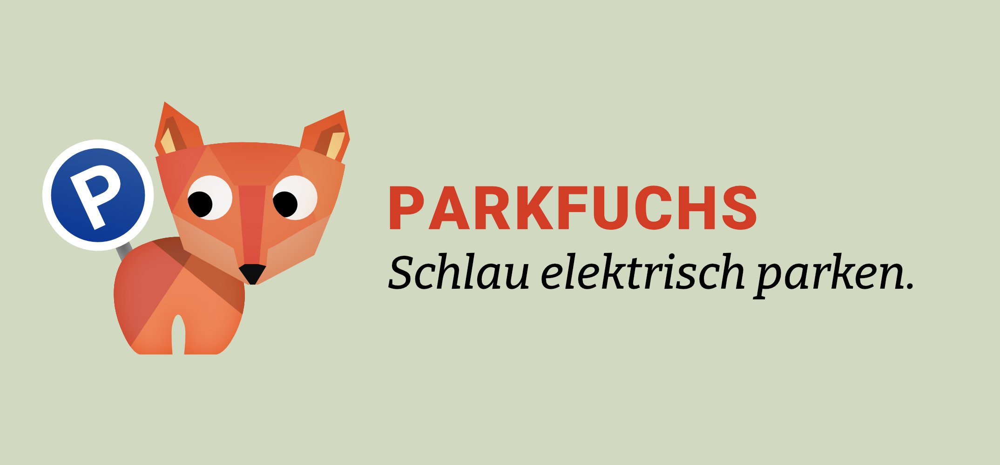

# Parkfuchs



**Go to [parkfuchs.app](https://parkfuchs.app)**

## Getting Started

First, run the development server:

```bash
npm run dev
```

Open [http://localhost:3000](http://localhost:3000) with your browser to see the result.

Using Next.js 13+.

You can start editing the page by modifying `app/page.tsx`. The page auto-updates as you edit the file.

The `app` directory is mapped to `app/api/*`. Files in this directory are treated as [API routes](https://nextjs.org/docs/api-routes/introduction) instead of React pages.

## Setup

Create a `.env` file

```bash
# Pocketbase server URI
DB_HOST=localhost:8080

# Your TomTom API key
TOMTOM_KEY=djahdi1xxxxxxxxx

```

# Build

## Nix

**Package**

```nix
nix build .#parkfuchs
```

**Update flake and Pocketbase**

```nix
nix flake update
```

**Docker**

```nix
docker build -t parkfuchs:latest
```

## Learn More

To learn more about Next.js, take a look at the following resources:

-   [Next.js Documentation](https://nextjs.org/docs) - learn about Next.js features and API.
-   [Learn Next.js](https://nextjs.org/learn) - an interactive Next.js tutorial.

You can check out [the Next.js GitHub repository](https://github.com/vercel/next.js/) - your feedback and contributions are welcome!
