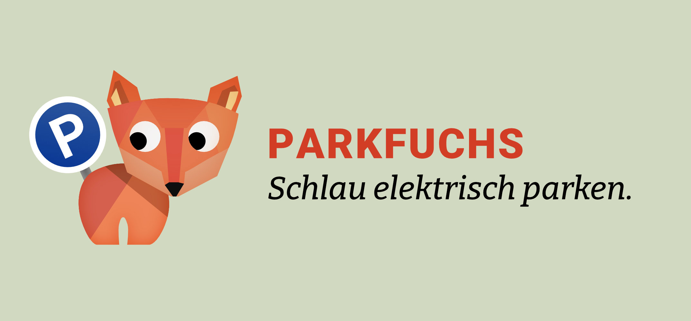

# Parkfuchs



**Go to [parkfuchs.app](https://parkfuchs.app)**

## Getting Started

Install dependencies and run the development server:

```bash
pnpm install
pnpm dev
```

Open [http://localhost:3000](http://localhost:3000) with your browser to see the result.

Built with [TanStack Start](https://tanstack.com/start) (TanStack Router + Vite + Nitro).
Routes live in `src/app`, server functions in `src/db/*.functions.ts` (backed by
`src/db/*.server.ts`), and the public `GET /api/city` endpoint in `src/app/api/city.ts`.

## Setup

Create a `.env` file:

```bash
# Pocketbase server URI
DB_HOST=http://localhost:8090

# Your TomTom API key
TOMTOM_KEY=djahdi1xxxxxxxxx
```

## Build

```bash
pnpm build
pnpm start
```

The production output is generated in `.output/` and served with
`node .output/server/index.mjs`.

## Nix

A dev shell with Node.js and pnpm is available:

```bash
nix develop
```

Build the package:

```bash
nix build .#parkfuchs
```

The NixOS module is exposed as `nixosModules.default` (`services.parkfuchs`).
